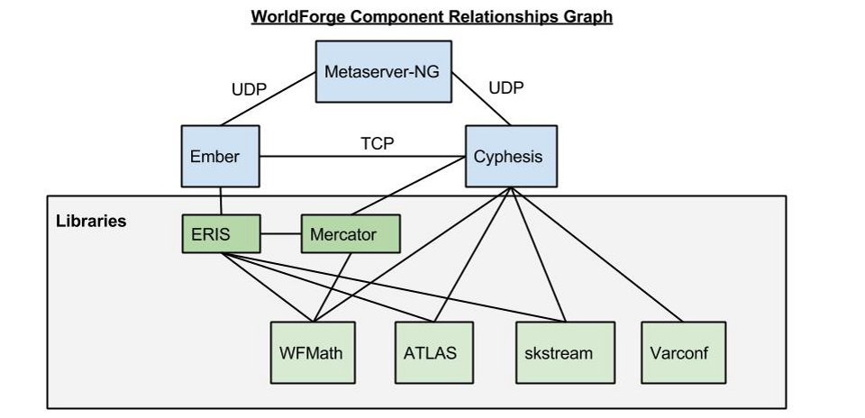

## Clients

Clients connect to the servers and provide a representation of the world, handling the players interactions with it. It is not meant to be a stand-alone, single-player game client. While there have been other clients developed in the past currently there is one actively developed client that provides both players and world builders with the most feature complete experience.

### Ember
[Ember](/components/ember) is a client framework for Worldforge. Its purpose is to provide a solid and extensible base from which to build game-specific clients. One of the goals of Ember is to allow for easy customization of the codebase. Currently it supports the game world of Deeds but in the future will allow for dynamic downloading of game assets for any game world. It's available for all modern Linux distributions, FreeBSD, OSX and MS Windows.
There are currently two actively developed servers.

## Servers

### Cyphesis
[Cyphesis](/components/cyphesis) is the world server that provides an example game world of rules and mechanics called Deeds that builds upon the earlier games of Acorn and Mason. It provides a persistent simulation filled with objects and artificial intelligence entities that can be interacted with in real time by both world builders and players.
### Metaserver-NG
The [MetaServer Next Generation](/components/metaserver) is a generic lobby type server. It provides a number of important services in its current functionality. Maintaining a list of currently available servers and their corresponding attributes. Provides a list of currently connected clients and their corresponding attributes. Provides a mechanism for servers to update information and for clients to query this information. Provides delegated authentication, if requested by the connecting server.
WorldForge has developed a number of libraries that provide useful functionality and are used by servers and clients. The following is a list of the ones actively maintained and used, although you will find more are available in the [Github repositories](https://github.com/worldforge).

## Libraries

### Atlas-C++
[Atlas-C++](/components/atlas) is the perhaps the most important library in the entire WorldForge project, since nearly every other module requires it. Atlas-C++ provides a native implementation of the entire Atlas specification including negotiation, message encode and decode and the overlying Objects layer.
### Eris
A client side session layer for WorldForge; [Eris](/components/eris) manages much of the generic work required to communicate with an Atlas server. Client developers can extend Eris in a number of ways to rapidly add game and client specific functions, and quickly tie game objects to whatever outpu representation they are using.
### Mercator
[Mercator](/components/mercator) is a procedural terrain library and is primarily aimed at terrain for multiplayer online games. It is intended to be used as a terrain library on the client with a subset of features are also useful on the server.
### Varconf
[Varconf](/components/varconf) is a configuration library intended for all applications. It manages configuration data in files, command line arguments, and is used by most WorldForge components.
### WFMath
The primary focus of [WFMath](/components/wfmath) is geometric objects. Thus, it includes several shapes (boxes, balls, lines), in addition to the basic math objects that are used to build these shapes (points, vectors, matricies). WFMath provides a means for other system compenents to pass geometric information around in a common format.
## Assets
There are two types of assets that provide game content.

### Worlds
The state of the [world](/components/worlds) and all the entities in existence is persistent if connected to a database. Worlds can be saved and loaded to a world server through the client if you have appropriate administrative rights. At their core all worlds are defined by a rule-set that must be loaded into world server before loading a world. It tells the world server what a types of things are and what they can do.

### Client Assets
The game client provides a representation of the game world with [Assets](/develop/media). These can be 3D models, textures, sounds, and more. 